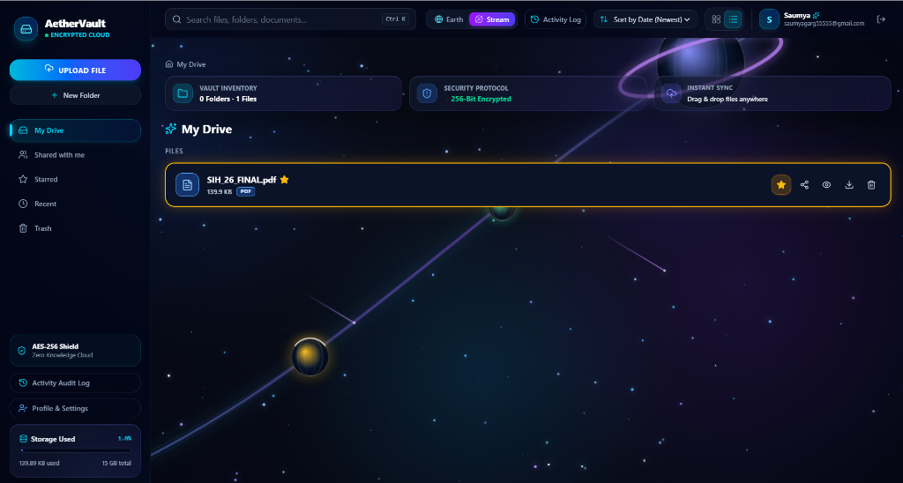
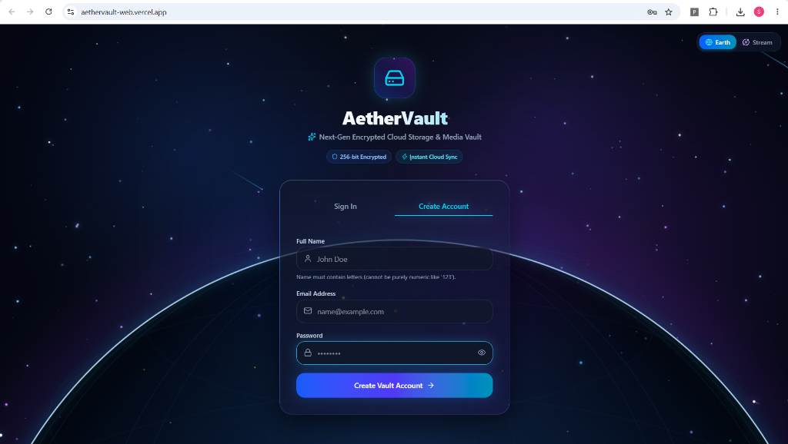
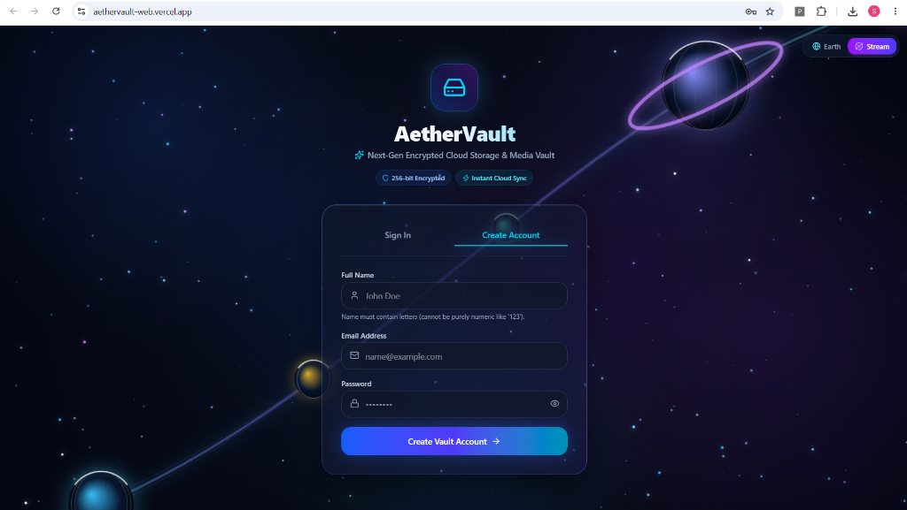

# 🌌 AetherVault — Modern Cloud File Storage & Sharing Platform

> A full-stack, enterprise-grade cloud file management application inspired by Google Drive, engineered with modern dark glassmorphism UI, dual dynamic theme modes (Earth & Stream), role-based sharing (ACL), password-protected public share links, file versioning, trash recovery, and audit logging.

---

## 🔗 Live Deployment & Repositories

- 🌐 **Live Web Application**: [https://aethervault-web.vercel.app](https://aethervault-web.vercel.app)
- ⚡ **Backend REST API**: [https://aethervault-api.onrender.com](https://aethervault-api.onrender.com)
- 💻 **Frontend GitHub Repo**: [https://github.com/Saumya-01git/aethervault-web](https://github.com/Saumya-01git/aethervault-web)
- ⚙️ **Backend GitHub Repo**: [https://github.com/Saumya-01git/aethervault-api](https://github.com/Saumya-01git/aethervault-api)

---

## 📸 Application Screenshots

### 🌌 1. Main Dashboard & File Management
| 🌍 Grid View (Earth Theme) | 🪐 List View (Stream Theme & Starred Files) |
| :---: | :---: |
|  |  |

### 🔐 2. Authentication & Theme Modes
| 🌍 Auth Screen (Earth Theme) | 🪐 Auth Screen (Stream Cosmic Theme) |
| :---: | :---: |
|  |  |

---

## 🚀 Key Features

- 🔐 **JWT Auth & Security**: User registration, login, session persistence, and password visibility toggle with cyan glow eye icon.
- 📁 **File & Folder Operations**: Create folders, upload files, rename, search, and navigate through nested breadcrumbs.
- 🤝 **User Sharing (ACL)**: Share files directly with registered user emails with custom roles (`Viewer` / `Editor`).
- 📥 **Shared With Me Tab**: View and access files shared with your account by other users.
- 🔗 **Public Share Links**: Generate unique shareable links for external users without requiring an account.
- 🔑 **Password Protection**: Secure public share links with optional passwords featuring an interactive HTML unlock page.
- ⌛ **Expiration Dates**: Set automatic expiration dates on public share links.
- 👤 **Owner Audit Details**: Public download pages display file details, owner info ("Shared By"), and instant download buttons.
- ⭐ **Starred Favorites**: Bookmark frequently accessed files and folders.
- ♻️ **Trash & Recovery**: Soft-delete items to Trash with instant 1-click restoration or permanent deletion.
- 📜 **Audit Activity Log**: Track all file upload, deletion, sharing, and link creation actions in real-time.
- 💎 **Dual Dynamic Themes**: Toggle between **Earth** and **Stream Cosmic** animated glassmorphic background modes.

---

## 🛠️ Tech Stack

- **Framework**: React 18 + Vite
- **Styling**: Tailwind CSS + Custom Glassmorphism
- **Icons**: Lucide React
- **HTTP Client**: Axios
- **Routing**: React Router DOM v6
- **Deployment**: Vercel

---

## ⚡ Quick Start (Local Setup)

### 1️⃣ Clone the Repository
```bash
git clone https://github.com/Saumya-01git/aethervault-web.git
cd aethervault-web
```

### 2️⃣ Install Dependencies
```bash
npm install
```

### 3️⃣ Configure Environment Variables
Create a `.env` file in the root directory:
```env
VITE_API_BASE_URL=https://aethervault-api.onrender.com/api
```
*(Or point to `http://localhost:8080/api` for local backend development)*

### 4️⃣ Start Development Server
```bash
npm run dev
```
Open your browser at `http://localhost:5173`.

---

## 📜 License

This project is licensed under the **MIT License**.
